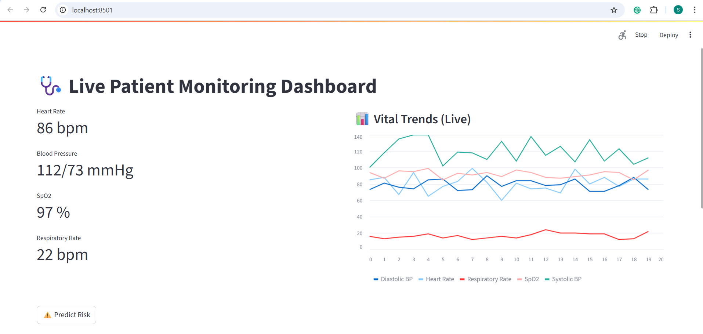
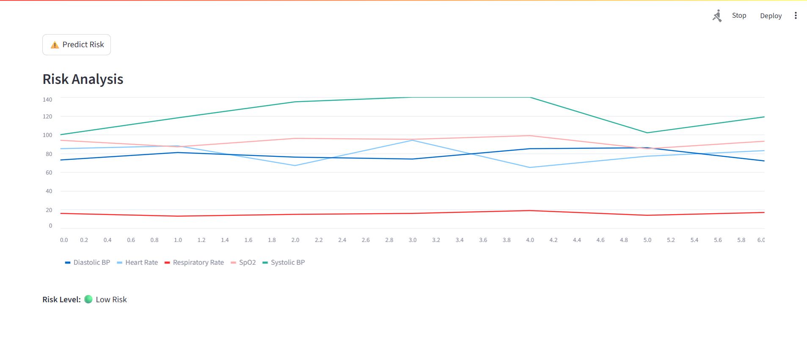
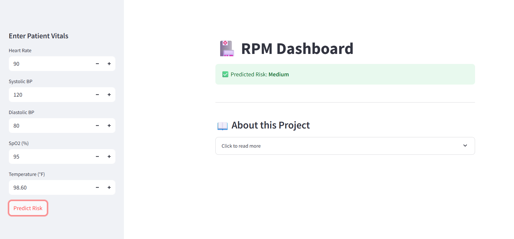

# 🩺 RPM Dashboard – Remote Patient Monitoring

This project is a **Remote Patient Monitoring (RPM) Dashboard** built using **Streamlit**.  
It provides two main functionalities:  

1. **Live Vitals Simulation**  
   - Simulates real-time patient vital signs (heart rate, blood pressure, oxygen saturation, temperature).  
   - Stores a history of simulated data points.  
   - A **Predict Risk** button re-plots the collected history and also classifies the patient’s health risk into **Low, Medium, or High**.  

2. **Manual Risk Prediction**  
   - Users can manually enter patient vitals.  
   - The dashboard predicts the risk level (Low/Medium/High) instantly based on entered data.  

## 🚀 Features

- 📊 **Real-time simulation** of patient vitals.  
- 🔮 **Risk classification** based on thresholds.  
- 🖊️ **Manual entry** for vitals and instant prediction.  
- 📉 **Historical plotting** of simulated vitals.  
- ⚡ Lightweight and easy to run (built on Streamlit).  

## 🛠️ Installation & Setup

1️⃣ Clone the Repository

git clone https://github.com/TaufeeqAhmad933/RPM-Dashboard.git
cd RPM-Dashboard

2️⃣ Create & Activate Virtual Environment

python -m venv .venv

Activate environment
On Windows:
.venv\Scripts\activate

On Mac/Linux:
source .venv/bin/activate

3️⃣ Install Requirements:
pip install -r requirements.txt

4️⃣ Run the App:
streamlit run app/streamlit_app.py

# Results

### 1. Live Vitals Dashboard

### 2. Risk Analysis

### 3. Manual Risk Prediction

## 📊 Risk Classification Logic

Low Risk → Normal vitals within safe range.
Medium Risk → Slight deviations from normal.
High Risk → Major abnormalities in one or more vitals.

## 📜 License

This project is licensed under the MIT License – see the LICENSE.md
 file for details.

## 👨‍💻 Author

Built with ❤️ by Taufeeq
